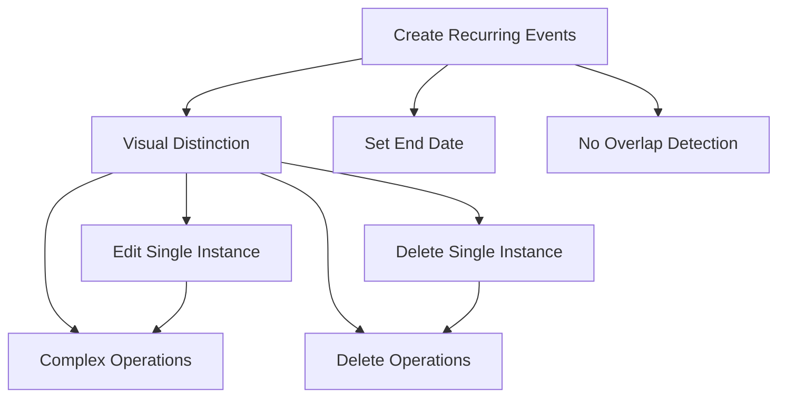

# User Stories: Recurring Events Management

**Epic**: EPIC-001 - Recurring Events Management System
**Sprint**: TBD
**Version**: 1.0

## Story Overview

Complete set of user stories covering all aspects of recurring events functionality from creation to management.

---

## STORY 1: Create Recurring Event with Repeat Types

**Story ID**: REC-001
**Priority**: High
**Story Points**: 8

### User Story

**As a** calendar user
**I want to** create recurring events with different repeat patterns
**So that** I don't have to manually create repetitive events

### Acceptance Criteria

- [ ] **Given** I am creating a new event
      **When** I toggle the "Repeat" option
      **Then** I should see repeat type options: None, Daily, Weekly, Monthly, Yearly

- [ ] **Given** I select "Daily" repeat type
      **When** I set an end date
      **Then** the system should generate daily events until the end date

- [ ] **Given** I select "Weekly" repeat type
      **When** I set an end date
      **Then** the system should generate weekly events on the same weekday until the end date

- [ ] **Given** I select "Monthly" repeat type
      **When** I set an event on the 31st and end date
      **Then** the system should create events only on months that have 31 days

- [ ] **Given** I select "Yearly" repeat type
      **When** I set an event on Feb 29 (leap year) and end date
      **Then** the system should create events only on leap years

### Definition of Done

- Repeat type selection UI implemented
- Date calculation logic for all repeat types
- Edge case handling (31st, Feb 29)
- Unit tests for date calculations
- Integration tests for event creation

---

## STORY 2: Visual Distinction for Recurring Events

**Story ID**: REC-002
**Priority**: Medium
**Story Points**: 3

### User Story

**As a** calendar user
**I want to** visually distinguish recurring events from single events
**So that** I can quickly identify which events are part of a recurring series

### Acceptance Criteria

- [ ] **Given** I view the calendar
      **When** there are recurring events displayed
      **Then** I should see a repeat icon next to recurring event titles

- [ ] **Given** I view the schedule list
      **When** there are recurring events displayed
      **Then** I should see a repeat icon in the schedule list for recurring events

- [ ] **Given** I hover over a recurring event
      **When** the tooltip appears
      **Then** it should indicate "Recurring Event" and show the repeat pattern

### Definition of Done

- Repeat icon added to event display components
- Icon displays correctly in both calendar and list views
- Tooltip functionality implemented
- Visual regression tests added

---

## STORY 3: Set End Date for Recurring Events

**Story ID**: REC-003
**Priority**: High
**Story Points**: 5

### User Story

**As a** calendar user
**I want to** specify when my recurring events should stop
**So that** I can control the duration of recurring series

### Acceptance Criteria

- [ ] **Given** I am creating a recurring event
      **When** I select a repeat type other than "None"
      **Then** I should see an "End Date" field

- [ ] **Given** I set an end date for a recurring event
      **When** the end date is before the start date
      **Then** I should see a validation error

- [ ] **Given** I set an end date after 2025-12-31
      **When** I try to save the event
      **Then** I should see a validation error limiting to 2025-12-31

- [ ] **Given** I don't set an end date
      **When** I create a recurring event
      **Then** the system should default to 2025-12-31

### Definition of Done

- End date field added to recurring event form
- Date validation implemented
- Maximum date constraint (2025-12-31) enforced
- Error handling and user feedback
- Form validation tests

---

## STORY 4: Edit Single Recurring Event Instance

**Story ID**: REC-004
**Priority**: High
**Story Points**: 8

### User Story

**As a** calendar user
**I want to** edit a single instance of a recurring event
**So that** I can make one-time changes without affecting the entire series

### Acceptance Criteria

- [ ] **Given** I click to edit a recurring event
      **When** the edit dialog appears
      **Then** I should see a confirmation dialog asking "해당 일정만 수정하시겠어요?"

- [ ] **Given** I click "예" (Yes) in the edit confirmation
      **When** I modify the event details and save
      **Then** only that single instance should be updated

- [ ] **Given** I edit a single instance
      **When** the changes are saved
      **Then** the event should become a non-recurring event (repeat icon removed)

- [ ] **Given** I edit a single instance
      **When** I view the calendar
      **Then** the other instances in the series should remain unchanged

### Definition of Done

- Edit confirmation dialog implemented
- Single instance editing functionality
- Conversion to non-recurring event
- Event series integrity maintained
- Integration tests for edit scenarios

---

## STORY 5: Edit Entire Recurring Event Series

**Story ID**: REC-005
**Priority**: High
**Story Points**: 6

### User Story

**As a** calendar user
**I want to** edit all instances of a recurring event
**So that** I can update the entire series at once

### Acceptance Criteria

- [ ] **Given** I click to edit a recurring event
      **When** the edit dialog appears
      **Then** I should see a confirmation dialog asking "해당 일정만 수정하시겠어요?"

- [ ] **Given** I click "아니오" (No) in the edit confirmation
      **When** I modify the event details and save
      **Then** all instances in the series should be updated

- [ ] **Given** I edit the entire series
      **When** the changes are saved
      **Then** all events should maintain their recurring status (repeat icon remains)

- [ ] **Given** I change the repeat pattern while editing the series
      **When** I save the changes
      **Then** the new pattern should be applied from the current date forward

### Definition of Done

- Series editing functionality implemented
- Bulk update operations
- Repeat pattern modification support
- Recurring status preservation
- Performance optimization for bulk updates

---

## STORY 6: Delete Single Recurring Event Instance

**Story ID**: REC-006
**Priority**: High
**Story Points**: 5

### User Story

**As a** calendar user
**I want to** delete a single instance of a recurring event
**So that** I can remove one occurrence without affecting the entire series

### Acceptance Criteria

- [ ] **Given** I click to delete a recurring event
      **When** the delete dialog appears
      **Then** I should see a confirmation dialog asking "해당 일정만 삭제하시겠어요?"

- [ ] **Given** I click "예" (Yes) in the delete confirmation
      **When** the deletion is confirmed
      **Then** only that single instance should be removed

- [ ] **Given** I delete a single instance
      **When** I view the calendar
      **Then** the other instances in the series should remain visible

- [ ] **Given** I delete a single instance
      **When** the deletion is complete
      **Then** the series should continue with the remaining instances

### Definition of Done

- Delete confirmation dialog implemented
- Single instance deletion functionality
- Series integrity maintained after deletion
- Proper cleanup of deleted instance
- Integration tests for delete scenarios

---

## STORY 7: Delete Entire Recurring Event Series

**Story ID**: REC-007
**Priority**: High
**Story Points**: 4

### User Story

**As a** calendar user
**I want to** delete all instances of a recurring event
**So that** I can remove the entire series at once

### Acceptance Criteria

- [ ] **Given** I click to delete a recurring event
      **When** the delete dialog appears
      **Then** I should see a confirmation dialog asking "해당 일정만 삭제하시겠어요?"

- [ ] **Given** I click "아니오" (No) in the delete confirmation
      **When** the deletion is confirmed
      **Then** all instances in the series should be removed

- [ ] **Given** I delete an entire series
      **When** I view the calendar
      **Then** no instances of that recurring event should be visible

- [ ] **Given** I delete an entire series
      **When** the deletion is complete
      **Then** the system should clean up all related data

### Definition of Done

- Series deletion functionality implemented
- Bulk delete operations
- Complete data cleanup
- Performance optimization for bulk deletes
- Confirmation and feedback mechanisms

---

## STORY 8: Recurring Events Don't Trigger Overlap Detection

**Story ID**: REC-008
**Priority**: Medium
**Story Points**: 3

### User Story

**As a** calendar user
**I want** recurring events to not trigger overlap warnings
**So that** I can create recurring events without unnecessary notifications

### Acceptance Criteria

- [ ] **Given** I create a recurring event
      **When** it overlaps with existing events
      **Then** no overlap dialog should appear

- [ ] **Given** I have existing recurring events
      **When** I create a new event that overlaps with them
      **Then** the overlap detection should ignore recurring events

- [ ] **Given** multiple recurring events overlap
      **When** they are displayed on the calendar
      **Then** they should be shown without conflict warnings

### Definition of Done

- Overlap detection logic updated
- Recurring events excluded from overlap checks
- Existing overlap functionality preserved for single events
- Unit tests for overlap logic

---

## Story Dependencies

## Testing Strategy

- **Unit Tests**: Date calculations, business logic, edge cases
- **Integration Tests**: End-to-end workflows, API interactions
- **User Acceptance Tests**: Real user scenarios, usability validation

---

**Created**: 2025-10-27
**Last Updated**: 2025-10-27
**Product Owner**: Product Team
**Development Team**: Engineering Team
